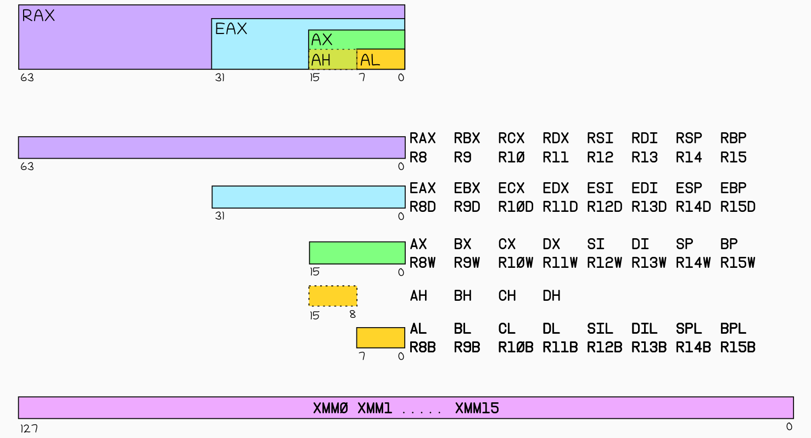

## ASM

### Prerrequisitos

* Instalar NASM y gdb
    
    ```bash
    sudo apt install build-essential nasm gdb wget
    ```
* Instalar gdb-dashboard (mejora la interfaz de gdb)

    [https://github.com/cyrus-and/gdb-dashboard]

    ```bash
    wget -P ~ https://git.io/.gdbinit
    ```

### Con respecto a la guía

Recomendación: Todos los programas deben escribirse en C y luego en ASM. Hacer una rutina en main que llame a la función en C y luego a la función en ASM. Imprimir los resultados para verificar que sean iguales.

Usar gdb para debuggear

### Machete



### Ejercicio 1

Escriba un programa que tome un vector de 16 enteros de 32 bits y los sume.

 * Tip 1: Utilice una etiqueta en la sección data para crear el vector.
 * Tip 2: Pueden usar DB, DW, DD, DQ ¿Cuál es el apropiado para un vector de enteros de 32 bits?

### Ejercicio 2 (strings)

Implementar las siguientes funciones en lenguaje C y en ASM:

a) Retorna la cantidad de caracteres distintos de cero del *string* pasado por parámetro. 

```C
uint32_t strLen(char* a);
```

b) Compara dos `strings` en orden lexicográfico [](https://es.wikipedia.org/wiki/Orden_lexicografico). Debe retornar:

* `0` si son iguales
* `1` si `a < b`
* `-1` si `b < a`

```C
int32_t strCmp(char* a, char* b);
```

c) Escribe el `string` en el stream indicado a través de `pFile`. Si el `string` es vacío debe escribir `NULL`.

```C
void strPrint(char* a, FILE* pFile);
```

### Ejercicio 3

Devuelve la cantidad de veces que aparece el caracter `c` en el `string` `s`.
```C
int countChars(char* s, char c);
```

### Ejercicio 4

Dado un string, devuelve un string *in-place* con los caracteres en orden inverso.

```C
void intercambiar(char*);
```

### Ejercicio 5

Dada una matriz de $n \times n$ enteros de 16 bits, devolver los elementos de la diagonal en el `vector` pasado por parámetro.

```C
void diagonal(short* matriz, short n, short* vector);
```


### Ejercicio 6

Dada una matriz de $n \times n$ pixeles RGB (1 byte por componente), hacer una función que convierta los pixeles a escala de grises usando la formula $(R+2 \cdot G+B)/4$

```C
void gris(pixel* matriz, short n, uint8_t* resultado);
```

### Ejercicio 7

Dada una matriz de `f`$\times$`c` enteros de 32 bits, encontrar el primer máximo buscando en el orden de la memoria: *ROW major order*. Ver [row and column major order](https://www.wikiwand.com/en/Row-_and_column-major_order). Devuelve un puntero a este valor y sus coordenadas en `f` y `c`.

```C

#define SIZE_C 10

int* primerMaximo(int (*matriz)[SIZE_C] , int* f, int* c);
```

